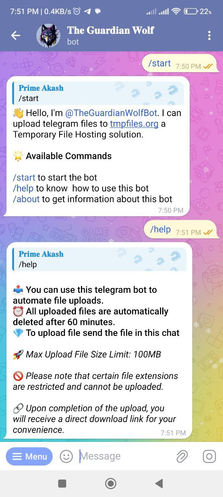
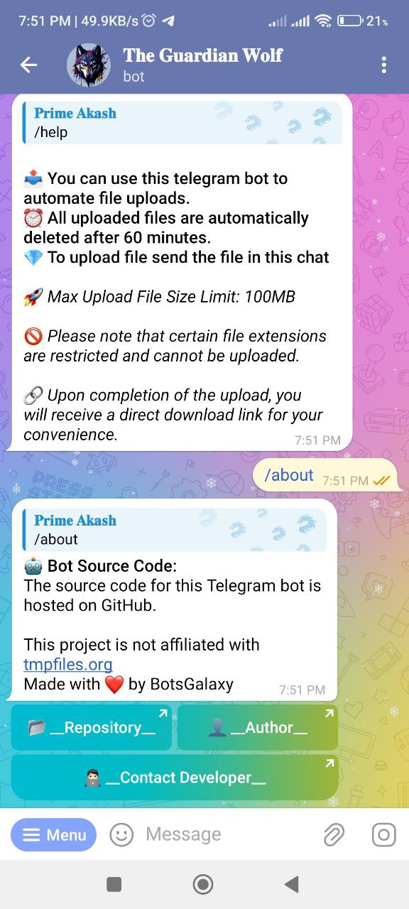
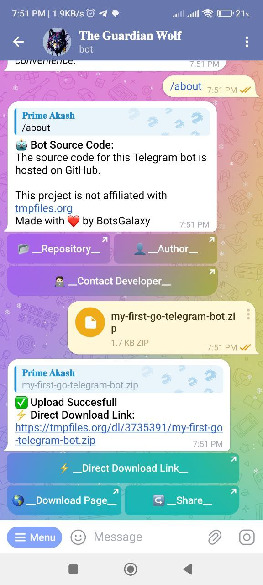

# Tmp Files Telegram Bot 

This bot, created in the 'Go' programming language, makes it simple to upload files to tmpfiles.org through Telegram.

## Featues 
- Upload Documents Easily: You can easily upload different types of documents using the bot. It ensures secure and temporary storage on tmpfiles.org.

- Get Direct Link: Retrieve direct links to your uploaded files. This makes it easier for you to access them.

- Share Links with a Button: There's a button that allows you to share the file link directly with others. It makes sharing quick and straightforward.

## Screenshots 
  

## Author
- [BotsGalaxy](https://github.com/botsgalaxy)
